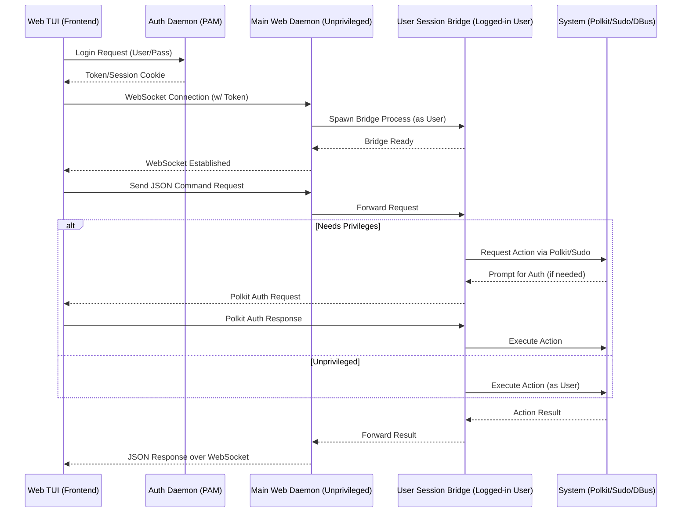

# Omarchy Web Management Interface - Security Model

## 1. Overview
This document outlines the privilege separation and escalation model for the Omarchy Web Management Interface, heavily inspired by Cockpit to prevent security regressions.

## 2. Core Privilege Rules
- **No Root Daemon:** The web process/daemon must **never** run as the `root` user.
- **Dedicated User:** The daemon runs as a dedicated, unprivileged system user (e.g., `omarchy-web`).
- **User Sessions:** When a user logs in via the UI (using PAM authentication), a dedicated bridge session/process is spawned running as that authenticated user.

## 3. Privilege Escalation Strategy
Just like Cockpit, privilege escalation happens only when strictly necessary, rather than elevating the entire daemon.

- **Polkit / Sudo wrappers:** For tasks that require elevated privileges (e.g., package management, disk manipulation, systemd control), the bridge process will utilize `polkit` (preferred) or explicit `sudo` execution wrappers.
- The web interface will prompt the user for password verification when an action requires elevated privileges via `polkit`.

## 4. Architecture Diagram

